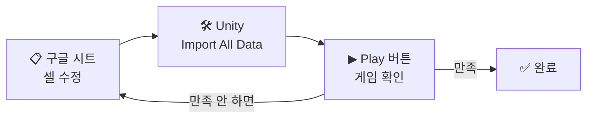
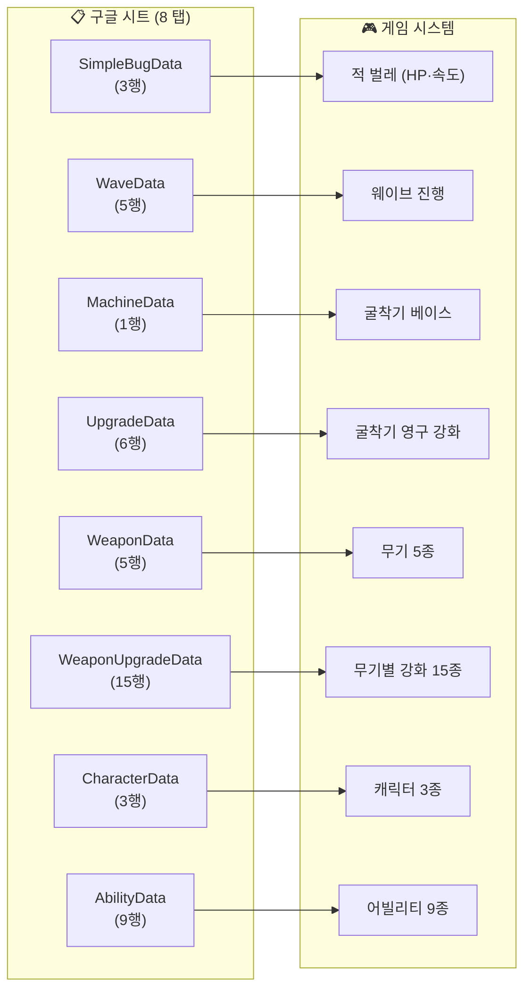
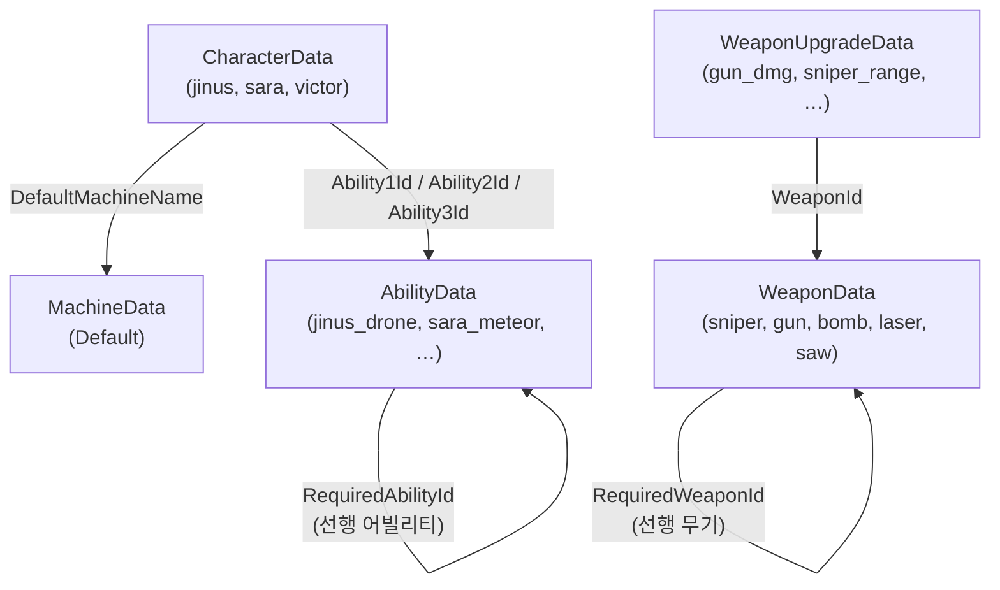

# 기획자용 시트 튜닝 가이드

> Drill-Corp 게임 밸런스를 **구글 시트에서 직접 조정**하는 워크플로우 안내.
>
> 대상: 기획자/디자이너 (Unity 미사용)
> 마지막 갱신: 2026-04-26

---

## 한 줄로 말하면

> **시트 한 셀 수정 → Unity 에서 "Import All Data" 버튼 → 게임 재실행 → 끝.**



---

## 1. 시트가 어디 있나

**스프레드시트**: https://docs.google.com/spreadsheets/d/1hwgQ4IF-gQqVSX4xS_uqeKIPWUDy2NR4bC-OWmZQO_E/edit

8개 탭이 있고, 각 탭이 게임의 한 시스템을 담당합니다.



**총 47행** — 게임 거의 모든 밸런스 다이얼이 한곳에.

| 탭 이름 | 무엇? | 행 |
|---|---|---|
| `SimpleBugData` | 적 벌레 3종 (HP·속도·크기) | 3 |
| `WaveData` | 웨이브 1~5 의 난이도 곡선 | 5 |
| `MachineData` | 굴착기 베이스 스탯 | 1 |
| `UpgradeData` | 굴착기 영구 강화 6종 | 6 |
| `WeaponData` | 무기 5종 베이스 스탯 (저격/폭탄/기관총/레이저/톱날) | 5 |
| `WeaponUpgradeData` | 무기별 강화 15종 (각 무기 3개씩) | 15 |
| `CharacterData` | 캐릭터 3종 (지누스/사라/빅터) | 3 |
| `AbilityData` | 캐릭터 어빌리티 9종 (캐릭터당 3개) | 9 |

### 시트끼리의 ID 참조 관계

`CharacterData` 와 `WeaponUpgradeData` 는 다른 시트의 ID 를 참조합니다 — 셀에 ID 문자열을 적으면 그 시트의 행과 자동으로 묶임.



> **포인트**: ID 셀의 글자가 정확히 일치해야 연결됨. 예를 들어 `CharacterData` 의 `Ability1Id=sara_metoer` (오타) 라면 그 캐릭터 슬롯이 빈 채로 import 됨. → §5-3 함정 참조.

---

## 2. 워크플로우 — 3 단계

### Step 1. 시트에서 셀 수정

예: `WeaponUpgradeData` 탭 → `gun_dmg` 행 → `BaseCostOre` 셀 → `70` → `50` 으로 변경.

수정한 후 그냥 두면 됨 (구글 시트는 자동 저장).

### Step 2. Unity 에디터에서 Import 버튼 클릭

1. Unity 에디터 켜기 (개발자에게 부탁)
2. 상단 메뉴 → `Tools → Drill-Corp → 4. 데이터 Import → Google Sheets Importer`
3. 창 열리면 **`Import All Data`** 버튼 클릭
4. 하단에 "전체 데이터 가져오기 완료!" 뜨면 성공

> **단독 시트 import**: 한 시트만 수정했으면 그 시트 버튼만 눌러도 됨 (`WeaponUpgradeData` 등). 더 빠름.

### Step 3. 게임 재실행 후 확인

Unity 에서 `Play` 버튼 → 게임 시작 → 변경된 값이 반영됐는지 확인.

> **주의**: Play 중에 import 해도 적용 안 됨. **import 후 Play** 순서.

---

## 3. 시트별 자주 만지는 셀

### `WeaponUpgradeData` — 무기 강화 비용·증가율

가장 자주 만질 시트. 무기당 3종 강화의 **레벨당 효과** + **비용**.

```
[수정 사례 1] 기관총 데미지 강화 효과 ↑
   gun_dmg 행 → ValuePerLevel 0.25 → 0.30
   → 한 레벨 올릴 때마다 +30% 데미지

[수정 사례 2] 비용 다운
   gun_dmg 행 → BaseCostOre 70 → 50
   → 1레벨 비용이 50광석으로 시작

[수정 사례 3] 최대 레벨 늘리기
   gun_dmg 행 → MaxLevel 5 → 7
```

### `AbilityData` — 어빌리티 쿨다운·데미지·범위

```
[수정 사례] 사라 충격파 너무 자주 씀
   sara_shockwave 행 → CooldownSec 1 → 5
```

### `WeaponData` — 무기 베이스 스탯

```
[수정 사례] 기관총 너무 약함
   gun 행 → Damage 0.5 → 0.7
```

### `MachineData` — 굴착기 기본 체력·채굴 속도

```
[수정 사례] 시작 HP 낮춰서 더 어렵게
   Default 행 → MaxHealth 100 → 80
```

### `UpgradeData` — 굴착기 영구 강화

```
[수정 사례] 보석 드랍률 강화 비용 인하
   gem_drop 행 → GemCostSchedule 15|30|50|75|105 → 10|20|35|55|80
```

### `CharacterData` — 캐릭터 기본 정보

이름·설명·테마색 정도. 밸런스 숫자는 거의 없음 — 어빌리티에 있음.

### `SimpleBugData` / `WaveData` — 적·웨이브

```
[수정 사례] 일반 벌레 너무 빠름
   Normal 행 → BaseSpeed 0.5 → 0.4

[수정 사례] 5웨이브 더 길게
   Wave_05 행 → KillTarget -1 (마지막 웨이브 = 세션 끝까지 유지)
```

---

## 4. 셀 입력 규칙 — 자주 헷갈리는 것

### 4-1. 색상 (Hex)

```
#RRGGBB 형식. 예: #51CF66 (초록)
```
**주의**: 구글 시트가 `#` 을 수식 시작으로 오해할 때 → 셀 앞에 작은따옴표(`'`) 추가.
```
'#51CF66 ← 이렇게 입력
```

### 4-2. 파이프 배열 (`|` 구분)

`OreCostSchedule`, `GemCostSchedule`, `ManualCostsOre` 등은 **여러 값을 한 셀에 모음**.
```
60|130|230|370|540   ← 1렙 60, 2렙 130, ..., 5렙 540
```
쉼표 쓰지 말 것 (구글 시트가 컬럼 분리해버림).

### 4-3. 불리언 (TRUE/FALSE)

대문자 `TRUE` / `FALSE`. 한글 "참"·"거짓" 안 됨. `1`·`0` 도 인식되지만 권장 X.

### 4-4. enum (정해진 단어)

엄격한 철자. 오타 시 import 거부.

| 컬럼 | 허용 값 |
|---|---|
| `WeaponUpgradeData.TargetStat` | `Damage` / `Range` / `Cooldown` / `AmmoBonus` / `ReloadTime` / `Radius` / `SlowBonus` |
| `WeaponUpgradeData.Operation` | `Add` / `Multiply` |
| `UpgradeData.UpgradeType` | `MaxHealth` / `Armor` / `MiningRate` / `MiningTarget` / `GemDropRate` / `GemCollectSpeed` |
| `UpgradeData.CurrencyType` | `Ore` / `Gem` / `Both` |
| `AbilityData.AbilityType` | `Napalm` / `Flame` / `Mine` / `BlackHole` / `Shockwave` / `Meteor` / `Drone` / `MiningDrone` / `SpiderDrone` |
| `AbilityData.Trigger` | `Manual` / `AutoInterval` |

### 4-5. 음수 (감소 효과)

쿨다운 단축·재장전 단축은 `ValuePerLevel` 을 **음수**로:
```
gun_reload → ValuePerLevel -0.20 = 레벨당 재장전 시간 20% 감소
```

### 4-6. 빈 셀 처리

- **숫자 컬럼이 빈 칸**: 보통 "기존 값 유지" — 빈 칸 = 변경 없음
- **이름·ID 컬럼이 빈 칸**: 그 행 전체 무시됨 (안전 장치)
- 명시적으로 0/false/없음 으로 만들고 싶으면 그 값을 직접 입력

### 4-7. ExtraStats — 무기별 고유 스탯 (`WeaponData` 만)

무기마다 다른 스탯이 한 셀에 압축됨:
```
maxAmmo:40|reloadDuration:5|spreadAngle:0.06
```
**구조**: `키1:값1|키2:값2|...`

각 무기에 허용된 키 (다른 무기 키 쓰면 import 거부):

| 무기 | 허용 키 |
|---|---|
| sniper | useAimRadius, customRange |
| bomb | explosionRadius, instant, projectileSpeed, projectileLifetime, explosionVfxLifetime |
| gun | maxAmmo, reloadDuration, lowAmmoThreshold, bulletSpeed, bulletLifetime, bulletHitRadius, spreadAngle |
| laser | cooldown, beamDuration, beamSpeed, stopDistance, beamRadius, tickInterval, scorchScaleMultiplier, scorchStopAfter, scorchTotalLifetime |
| saw | orbitRadius, bladeRadius, spinSpeed, damageTickInterval, slowFactor, slowDuration |

---

## 5. 자주 발생하는 함정

### 5-1. "Import 했는데 게임에 반영 안 됨"

원인 후보 (자주 발생 순):
1. **Play 중에 Import 함** → 일단 Play 멈추고 다시 Import 후 Play
2. **시트 수정 후 저장 안 됐을 때** → 구글 시트 자체는 자동 저장이지만, 다른 사용자가 동시 편집 중이면 충돌 가능 → 셀 다시 클릭해서 값 확인
3. **셀 형식 오류** → Unity 콘솔에 에러 로그 (§6 참조)

### 5-2. "값이 빈 칸인데 0 이 들어감"

빈 칸의 의미는 시트별·컬럼별로 다름:
- 대부분: "기존 값 유지" (변경 안 됨)
- 일부: "기본값 사용" (0 / false 등)

확실하게 0 으로 만들고 싶으면 셀에 `0` 직접 입력.

### 5-3. "캐릭터 어빌리티가 비어있음"

`CharacterData` 의 `Ability1Id` / `Ability2Id` / `Ability3Id` 가 `AbilityData` 의 `AbilityId` 와 정확히 일치하지 않으면 캐릭터 슬롯이 빈 채로 import 됨.

→ 두 시트의 ID 셀이 **글자·대소문자까지 일치** 하는지 확인.

### 5-4. "단독 import 가 캐릭터에 반영 안 됨"

`CharacterData` 만 단독 import → AbilityData 가 변경된 게 있다면 슬롯 매칭 실패.

해결: 한 번 **`Import All Data`** 누르면 자동으로 `AbilityData → CharacterData` 순서로 import 되므로 안전.

### 5-5. "ExtraStats 셀이 분리됨"

콤마(,) 가 ExtraStats 안에 들어가면 구글 시트가 컬럼 분리. 반드시 **파이프(`|`)** 만 사용.

---

## 6. 문제 진단 — Unity 콘솔 로그 보는 법

Import 시 Unity `Console` 창 (메뉴 `Window → General → Console`) 에 로그가 뜸.

### 정상

```
[GoogleSheetsImporter] Imported: gun_dmg (Damage, Multiply)
[GoogleSheetsImporter] Imported Weapon: sniper
[GoogleSheetsImporter] Imported Ability: jinus_drone
```

### 자주 보는 경고/에러

| 메시지 패턴 | 원인 | 해결 |
|---|---|---|
| `허용되지 않은 키 'XXX' ('YYY' 무기 전용)` | ExtraStats 에 다른 무기 키 입력 | 행 잘못 입력했는지, 키 철자 확인 |
| `TargetStat='XXX' 파싱 실패` | enum 철자 오타 | §4-4 표 참조해서 정확한 철자로 수정 |
| `RequiredAbilityId='XXX' 인 SO 없음 — null 처리` | 선행 어빌리티 ID 가 다른 행에 없음 | `AbilityData` 시트에 그 ID 가 있는지 확인 |
| `DefaultMachineName='XXX' 인 MachineData 없음` | `MachineData` 에 그 이름 행이 없음 | 머신 이름 철자 확인. v2 는 `Default` 만 |
| `WeaponId='XXX' 에 해당하는 SO가 없음` | 시트에 신규 무기 추가했는데 Unity SO 가 없음 | 신규 무기는 시트만으론 추가 불가 — 개발자에게 부탁 |

---

## 7. 시나리오별 가이드

### A. 무기 밸런스 패스 (대규모 조정)

1. `WeaponData` — 베이스 데미지·발사간격 조정
2. `WeaponUpgradeData` — 강화 효과·비용 조정 (특히 ValuePerLevel 과 BaseCostOre)
3. `Import All Data`
4. 인게임 1~3 웨이브 플레이로 체감

### B. 어빌리티 쿨다운 일제 조정

1. `AbilityData` 탭 열기
2. `CooldownSec` 컬럼 정렬해서 한눈에 보기
3. 각 행 수정
4. Import → Play

### C. 신규 강화 항목 추가

`WeaponUpgradeData` 또는 `UpgradeData` 에 행 추가:
1. 기존 행 한 줄 복사해서 아래에 붙여넣기
2. `UpgradeId` 를 새 ID 로 변경 (영문 소문자_)
3. 나머지 컬럼 채우기
4. **Import All Data** (단독 import 도 가능)
5. **개발자 확인 필요**: UI 가 그 강화를 보여주는지 (UI 가 강화 항목을 동적으로 그리지 않으면 코드 추가 필요할 수 있음)

### D. 캐릭터 추가 — 시트만으로는 불가

신규 캐릭터·신규 무기·신규 어빌리티 추가는 **개발자에게 요청 필요** (Unity 에서 SO 인스턴스를 먼저 만들어야 시트가 매칭됨).

기존 캐릭터/무기/어빌리티의 **숫자만** 조정은 시트만으로 가능.

---

## 8. 도움 요청

- **시트 자체 문제** (권한·동시편집 충돌): 시트 owner 에게
- **Import 에러**: Unity 콘솔 에러 로그 캡처해서 개발자에게
- **게임 동작 이상**: "X 값을 Y 로 바꿨더니 Z 가 이상함" 형태로 개발자에게

## 부록 — 참고 문서 (개발자용)

- 시트 컬럼 풀 정의 + Import 동작 상세: [Data-SheetsGuide.md](Data-SheetsGuide.md)
- 데이터 계층 구조 (시트 ↔ ScriptableObject ↔ 런타임): [Overview-DataStructure.md](Overview-DataStructure.md)
- 무기 시스템 설계: [Sys-Weapon.md](Sys-Weapon.md)
- 캐릭터·어빌리티 설계: [Sys-Character.md](Sys-Character.md)
- 보석 드랍·이중 재화: [Sys-Gem.md](Sys-Gem.md)
